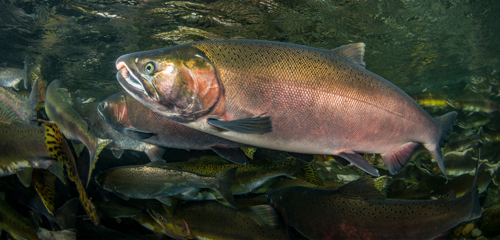
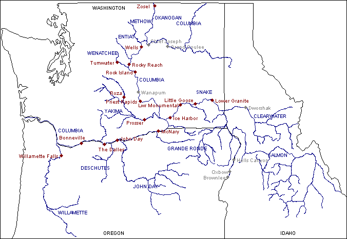

## Overview



**Image source:** Wild Salmon Center (https://wildsalmoncenter.org/2019/08/12/forestry-board-moves-to-protect-oregon-coho/)

This report explores adult fish passage data observed from 2001 to 2010 at the Willamette Falls fish ladder on the Willamette River in Oregon. Data was shared by Columbia River DART (Data Access in Real Time). Time series exploration and visualization techniques are used to summarize the time series data. Analysis throughout this report focuses on coho, jack coho, and steelhead salmon at Willamette Falls.



**Map source:** Dart Sport Fishing and Recreation Adult Returns. Columbia Basin Research (http://www.cbr.washington.edu/dart/query/sport_rec_adult)

**Data citation:** DART Adult Passage Graphics & Text. Columbia Basin Research (http://www.cbr.washington.edu/dart/query/adult_graph_text)

Data Courtesy of U.S. Army Corps of Engineers, NWD and Chelan, Douglas, and Grant County PUDs, Yakima Klickitat Fisheries Project, Colville Tribes Fish & Wildlife (OBMEP), Oregon Department of Fish & Wildlife, Washington Department of Fish & Wildlife

## Data wrangling

```{r setup, include=TRUE, message = FALSE, warning = FALSE, class.source = 'fold-show'}
knitr::opts_chunk$set(echo = TRUE, message = FALSE, warning = FALSE)

library(tidyverse)
library(here)
library(janitor)
library(lubridate)
library(tsibble)
library(feasts)
library(patchwork)
```

```{r}
# Read in the data
fish_passage <- read_csv(here("data", "willamette_fish_passage.csv"))
```

```{r}
# Replace NA values with zero
fish_passage_clean <- fish_passage %>% 
  clean_names() %>% 
  mutate_all(~replace_na(.,0))
```

```{r}
# Convert to _ts format
fish_passage_ts <- fish_passage_clean %>% 
  mutate(date = mdy(date)) %>% 
  as_tsibble(key = NULL, index = date) 
```

## Data visualizations {.tabset}
### Original time series

```{r}
# coho time series plot
coho <- ggplot(data = fish_passage_ts, aes(x = date, y = coho)) + 
  geom_line(color = 'darkred') +
  labs(x = 'Year',
       y = 'Coho\nsalmon',
       title = 'Adult passage for coho salmon at Willamette Falls',
       subtitle = '2001 - 2010') +
  theme_minimal()
```

```{r}
# jack coho time series plot
jack_coho <- ggplot(data = fish_passage_ts, aes(x = date, y = jack_coho)) + 
  geom_line(color = 'deepskyblue4') +
  labs(x = 'Year',
       y = 'Jack coho\nsalmon',
       title = 'Adult passage for jack coho salmon at Willamette Falls',
       subtitle = '2001 - 2010') +
  theme_minimal()
```

```{r}
# steelhead time series plot
steelhead <- ggplot(data = fish_passage_ts, aes(x = date, y = steelhead)) + 
  geom_line(color = 'darkgreen') +
  labs(x = 'Year',
       y = 'Steelhead\nsalmon',
       title = 'Adult passage for steelhead salmon at Willamette Falls',
       subtitle = '2001 - 2010') +
  theme_minimal()
```

```{r}
# Combine graphs into one plot
coho / jack_coho / steelhead
```

**Figure 1.** Time series visualizations to represent the adult fish passage data that was collected daily from 2001 to 2010 for coho, jack coho, and steelhead salmon at Willamette Falls.

- The peaks in the time series data show that there is seasonality with adult fish passage for coho, jack coho, and steelhead.
- Adut fish passage for coho salmon appears to increase from 2001 to 2010; however, there are no strong trends prevalent for adult fish passage for jack coho and steelhead.

### Seasonplots

```{r}
# Use monthly data to create a smoother plot than the plot that uses daily data above
fish_passage_month <- fish_passage_ts %>% 
  index_by(yr_mo = ~yearmonth(.)) %>% 
  summarize(monthly_mean_passage_coho = mean(coho, na.rm = TRUE),
            monthly_mean_passage_jack_coho = mean(jack_coho, na.rm = TRUE),
            monthly_mean_passage_steelhead = mean(steelhead, na.rm = TRUE))
```

```{r}
# coho seasonplot
coho_seasonplot <- fish_passage_month %>% 
  gg_season(y = monthly_mean_passage_coho) +
  labs(x = 'Year',
       y = 'Coho\nsalmon',
       title = 'Mean annual adult passage for coho salmon at Willamette Falls',
       subtitle = '2001 - 2010') +
  theme_minimal() +
  theme(legend.position = 'none')
```

```{r}
# jack coho seasonplot
jack_coho_seasonplot <- fish_passage_month %>% 
  gg_season(y = monthly_mean_passage_jack_coho) +
  labs(x = 'Year',
       y = 'Jack coho\nsalmon',
       title = 'Mean annual adult passage for jack coho salmon at Willamette Falls',
       subtitle = '2001 - 2010') +
  theme_minimal() +
  theme(legend.position = 'none')
```

```{r}
# steelhead seasonplot
steelhead_seasonplot <- fish_passage_month %>% 
  gg_season(y = monthly_mean_passage_steelhead) +
  labs(x = 'Year',
       y = 'Steelhead\nsalmon',
       title = 'Mean annual adult passage for steelhead salmon at Willamette Falls',
       subtitle = '2001 - 2010') +
  theme_minimal() +
  theme(legend.position = 'bottom')
```

```{r}
# Combine seasonplots into one plot
coho_seasonplot / jack_coho_seasonplot / steelhead_seasonplot
```

**Figure 2.** Seasonplots to visualize adult fish passage data for coho, jack coho, and steelhead salmon on a monthly basis from 2001 to 2010 at Willamette Falls.

- Coho and jack coho salmon both appear to have peaks in adult passage from August to November.
- Steelhead salmon appear to peak in adult passage from January to July.

### Annual counts by species

```{r}
# annual data
fish_passage_year <- fish_passage_ts %>% 
  index_by(yr = ~year(.)) %>% 
  summarize(annual_count_passage_coho = sum(coho, na.rm = TRUE),
            annual_count_passage_jack_coho = sum(jack_coho, na.rm = TRUE),
            annual_count_passage_steelhead = sum(steelhead, na.rm = TRUE))
```

```{r}
# coho annual count plot
coho_annual_count <- ggplot(data = fish_passage_year, 
                            aes(x = factor(yr), y = annual_count_passage_coho)) +
  geom_col(fill = 'darkred') +
  labs(x = 'Year',
       y = 'Coho\nsalmon',
       title = 'Annual total for coho salmon passage at Willamette Falls',
       subtitle = '2001 - 2010') +
  theme_minimal()
```

```{r}
# jack coho annual count plot
jack_coho_annual_count <- ggplot(data = fish_passage_year, 
                            aes(x = factor(yr), y = annual_count_passage_jack_coho)) +
  geom_col(fill = 'deepskyblue4') +
  labs(x = 'Year',
       y = 'Jack coho\nsalmon',
       title = 'Annual total for jack coho salmon passage at Willamette Falls',
       subtitle = '2001 - 2010') +
  theme_minimal()
```

```{r}
# steelhead annual count plot
steelhead_annual_count <- ggplot(data = fish_passage_year, 
                            aes(x = factor(yr), y = annual_count_passage_steelhead)) +
  geom_col(fill = 'darkgreen') +
  labs(x = 'Year',
       y = 'Steelhead\nsalmon',
       title = 'Annual total for steelhead salmon passage at Willamette Falls',
       subtitle = '2001 - 2010') +
  theme_minimal()
```

```{r}
# Combine the annual count plots into one plot
coho_annual_count / jack_coho_annual_count / steelhead_annual_count
```

**Figure 3.** Annual total counts of fish passage for coho, jack coho, and steelhead salmon at Willamette Falls from 2001 to 2010.

- Annual fish passage of coho salmon has increased from 2001 to 2010.
- However, annual fish passage of steelhead salmon has decreased from 2001 to 2010.
- Annual fish passage of jack coho salmon appears to have peaks during some years and is less consistent over time than passage of the coho and steelhead salmon.
